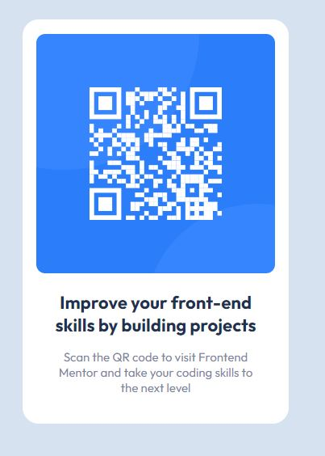

# Frontend Mentor - QR code component solution

This is a solution to the [QR code component challenge on Frontend Mentor]
(https://www.frontendmentor.io/challenges/qr-code-component-iux_sIO_H). Frontend Mentor challenges help you improve 
your coding skills by building realistic projects. 

## Table of contents

- [Overview](#overview)
  - [Screenshot](#screenshot)
  - [Links](#links)
- [My process](#my-process)
  - [Built with](#built-with)
  - [What I learned](#what-i-learned)
  - [Continued development](#continued-development)
  - [Useful resources](#useful-resources)
- [Author](#author)
- [Acknowledgments](#acknowledgments)

## Overview
This is only an practice exercice for improve my style abilities with html and css

### Screenshot

### Links

- Solution URL: [Add solution URL here](https://github.com/GustavoMunizBarrios/QR-code-)
- Live Site URL: [Add live site URL here](https://qr-code-one-delta.vercel.app/)

## My process
First I made the structure of the QR card and then I add styles with CSS 

### Built with

- Semantic HTML5 markup
- CSS custom properties
- Flexbox
- Mobile-first workflow

### What I learned

I learned to use flexbox in a better way and I aplicated the root to my file 

## Author

- Website - [Add your name here](https://www.your-site.com)
- Frontend Mentor - [@yourusername](https://www.frontendmentor.io/profile/yourusername)
- Twitter - [@yourusername](https://www.twitter.com/yourusername)

